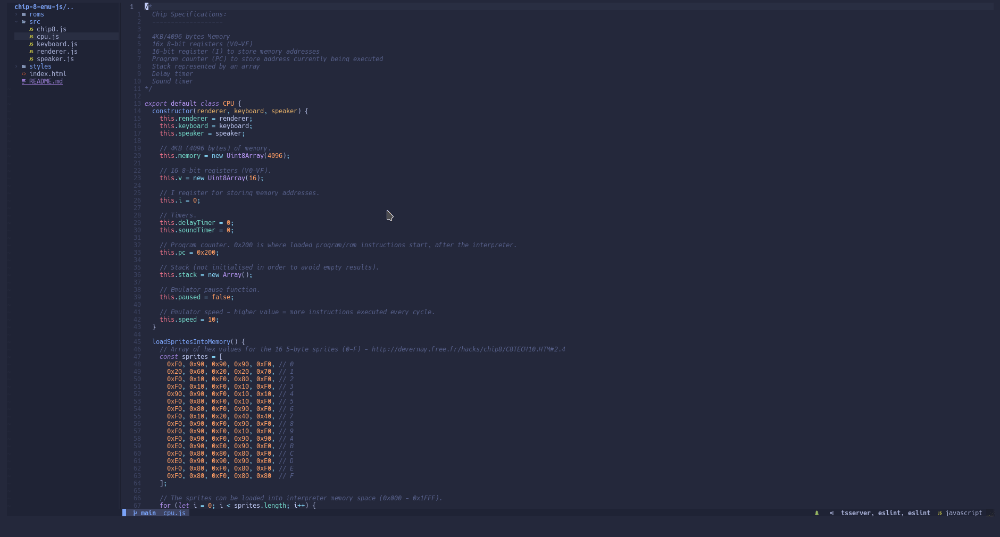

If you don't have an above amazing working memory or don't possess an eidetic memory, having reference material at hand helps a lot to get coding or writing tasks done. There are a few solutions to this problem ranging from having an extra monitor to [getting a brain tumor like George Malley](https://www.imdb.com/title/tt0117333/).

In this post, however, I will discuss how I used [Neovim](https://neovim.io/) and [Lua](http://www.lua.org/) to write a few functions that allow me to open a small floating window and either show the output of a cheatsheet from [cht.sh](http://cht.sh/) or interact with a full-blown browser from which to reference any material. It is worth noting that the browsers support by this method are [limited¹](#_footnotes_) to command line browsers such as [Lynx](http://lynx.browser.org/), [w3m](http://w3m.sourceforge.net/) etc.

## Requirements

- [Nvim](https://neovim.io/)
- [curl](https://curl.se/)
- [w3m](http://w3m.sourceforge.net/)

## Demo



## [The Code](https://lkml.org/lkml/2000/8/25/132)

Most of the logic at the moment resides in a [single function 😭](https://en.wikipedia.org/wiki/Single-responsibility_principle). I've commented all the parts that may not be clear from my coding style.

First let's get a few utility functions out of the way:

```lua
-- A utility function that trims whitespace for the beginnig of strings.
local ltrim = function (s)
  return s:match'^%s*(.*)'
end

-- A utility function that trims whitespace for the end of strings.
local rtrim = function (s)
  return s:match'^(.*%S)%s*$'
end
```

And now for the pièces de résistance:

```lua
--[[
  The function to open a terminal (with a command running within) in a floating window.

  param: q - the label to display when asking for input.
  param: use_browser - whether or not to execute the browser.
]]--
open_term_buffer = function (q, use_browser)
  -- The question/phrase to search for.
  local question = vim.fn.input(q, '', 'file')
  -- The empty buffer in which to place the result.
  local buf = vim.api.nvim_create_buf(false, true)
  local editor_width = vim.api.nvim_get_option('columns')
  local window_width = 120
  local window_height = 40
  local top = 0
  local opts = {
    relative = 'win',
    width = window_width,
    height = window_height,
    col = editor_width,
    row = top,
    anchor = 'SE',
    border = 'single',
    style = 'minimal',
  }

  -- Only execute if the query was aborted.
  if q then
    if use_browser then
      -- The browser to use e.g. 'lynx'.
      local browser = 'w3m'
      -- Your choice of search engines (ddg FTW!).
      local www_search = 'duckduckgo.com/?q='
      local url = www_search..question

      -- Open a window with the empty buffer.
      vim.api.nvim_open_win(buf, 0, opts)
      -- Open a new terminal within the buffer and run the browser with its params.
      -- The double escaping is required in order to echo the "".
      vim.cmd('edit term://'..browser..' \\"'..url..'\\"')
    else
      -- Extract the language/tool to query cht.sh with.
      local lang = rtrim(string.sub(question, 0, string.find(question, ' ')))
      -- Extract the question and prepare it for cht.sh.
      local s = string.gsub(ltrim(string.sub(question, string.find(question, ' '), -1)), '%s', '+')

      -- Open a handle to the system command curl.
      local cmd_handle = io.popen('curl https://cht.sh/'..lang..'/'..s)
      -- Read from the handle.
      local result = cmd_handle:read('*a')
      cmd_handle:close()

      -- The empty table needed to fill the results with.
      local output = {}
      -- Split the result up into lines.
      for line in string.gmatch(result, '[^\r\n]+') do
        -- Strip all carriage returns.
        line = string.gsub(line, '\n', '')
        -- Strip the colourcodes.
        line = string.gsub(line, '[\x1B\\[[0-9;]+[A-Za-z]', '')
        -- Add line to output table.
        table.insert(output, line)
      end

      -- Insert the output into the awaiting buffer.
      vim.api.nvim_buf_set_lines(buf, 0, -1, true, output)
      -- Display the window with the buffer.
      vim.api.nvim_open_win(buf, 0, opts)
    end
  end
end
```

## Accessing The Shiny New Functionality

I have assumed that you are would place this code within an `init.lua` [config file](https://github.com/nanotee/nvim-lua-guide#initlua) or [wrapping the above lua²](#_footnotes_) with `lua` tags.

Creating a keybinding using Lua, one could do one of the following:

### The Vim Way

```lua
vim.cmd("nnoremap <leader>rb <cmd>lua open_term_buffer('Search: ', true)<CR>")`
vim.cmd("nnoremap <leader>rc <cmd>lua open_term_buffer('Cht.sh: ')<CR>")`
```

### The Neovim Way

```lua
vim.api.nvim_set_keymap('n', '<leader>rb',  [[<cmd>lua open_term_buffer('Search: ', true)<CR>]], { noremap = true, silent = true })
vim.api.nvim_set_keymap('n', '<leader>rc',  [[<cmd>lua open_term_buffer('Cht.sh: ')<CR>]], { noremap = true, silent = true })
```

I hope this is helpful 🦾

> _**Footnotes**_
>
> 1. These perceived limitations that non-commandline acolytes refer to are **ENTIRELY** self-imposed ✊
> 2. Simply surround the Lua with `lua` tags suchly:
>
> ```vim
> lua <<EOF
> print('Some snazzy Lua code here 😎')
> EOF
> ```
