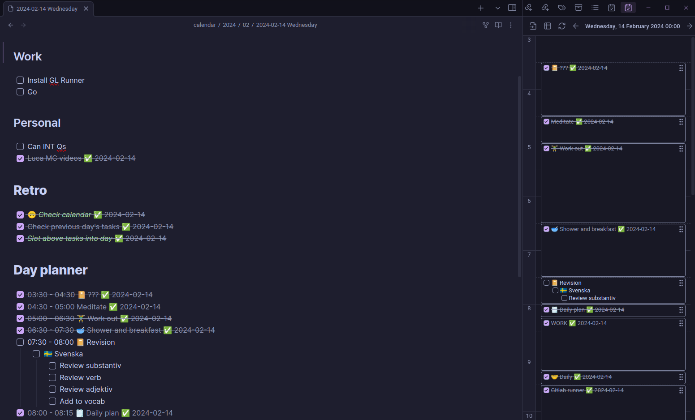

There are plenty of [fun](https://en.wikipedia.org/wiki/Sarcasm) things that come with having [Obsessive Compulsive Disorder (OCD)](https://en.wikipedia.org/wiki/Obsessive%E2%80%93compulsive_disorder), but I find that having strategies and structure during my day helps to keep much of the anxiety that OCD creates to a minimum, with most of the unavoidable anxiety at least being planned for and expected.

During a healthy, structured stint, I have a daily schedule that I try and adhere to. Over the years I have ended up being too rigid with the schedule and this usually leads to missing time slots and then beating myself up for not being able to stick to this "brilliant schedule".

It may seem obvious to some, but life has a way of throwing unexpected things our way and these can't be scheduled. This is a problem because OCD manifests as an obsessive need to control external happenings in order to allay obsessive thoughts that cause extreme anxiety (and in more serious cases, the belief of some apocalyptic event). 

So what I try to do is create a schedule that I feel is doable but to stay conscious of unexpected, uncontrollable moments during the day. But more importantly, if the day didn't pan out exactly as planned I try to remember that some things are out of my control.

However, there are days where adherence to the schedule ~~fails~~ veers off course due to lapses in motivation, dips in energy, suffocating external stressors, bouts of falling into OCD spirals, to name a few. When this happens it's more difficult to accept, recover and/or forgive myself for the perceived failures. Sometimes the only thing that helps is totally disconnecting from things and recharging in a dark spot for the rest of the day.

That said, there are a few larger blocks of time or events in my day that, if I hit, I can concede that the day was productive - such as exercise, work etc.

I block out my calendar for most of the events and tasks that I want to get done. Using the [Obsidian Day Planner](https://github.com/ivan-lednev/obsidian-day-planner) plugin in Obsidian, I'm able keep a timeline of my day that clearly shows upcoming tasks and where I am currently in the day. When this process works, I take a few minutes each day to review the previous day's tasks, move incomplete or ongoing tasks over to the current day and populate meetings from my calendar. 

Following is an example of a typical daily schedule:

# Dealing with Low Motivation or Boring Work

I try to use the [Pomodoro technique](https://en.wikipedia.org/wiki/Pomodoro_Technique) to manage boring tasks or to get moving if I feel particularly sluggish both physically or mentally. I would tell myself that I will start with a 25 minute session and see how I feel after that. If all I needed was a push to get started, then I would use the technique for the remainder of the task or the time allocated for the task. If I still feel blocked, I'd shelve the task (if it is shelvable) for the day and try again the following day.

If I am struggling with motivation, I would reward myself with a video or episode of a series in between sessions of work, go for a walk, do something fun or completely different or take a nap.

# The Reality

The above is a framework and strategies that I use to structure my day. It may sound like I'm an über productive member of society who has all these tactics and healthy habits, but the reality is that this plan and strategies allow me to be productive about half the time. The other half is ~~battling~~ managing the OCD and trying to make it through the day with as little damage (mentally) as possible while meeting my external responsibilities as best as I can.

