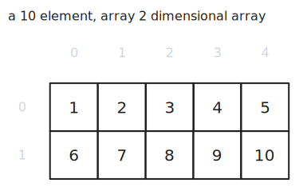

> This article is the first in a [series of articles](/category/programming/general/data-structures/) about data structures.

Arrays are one of the more basic data structures and very broadly-used. Arrays are stored in contiguous memory chunks which provides some benefits and drawbacks. In some languages like JavaScript however, arrays are objects and thus not of a fixed size or necessarily stored contiguously.

Indexing into an array is done in [constant time](/category/programming/general/understanding-big-o/#constant-time-or-o1), while iterating through an array is done in [linear time](/category/programming/general/understanding-big-o/#linear-time-or-on).

## One Dimensional Arrays

### Advantages

- because the data is stored in contiguous memory, sequential access is fast as we're able to take advantage of cache efficiency
- accessing a known index is done in constant time ($O(1)$)

### Disadvantages

- because the data is stored in contiguous memory, arrays can not be resized and need to be declared with a size up front
- certain programming languages make it appear that an array is being resized, but usually a larger copy is made elsewhere in memory which comes at a cost

### Usage Examples

- list of integers like a list of employees
- implementation of a stack

## Multi Dimensional Arrays

Multi-dimension arrays are, in essence, arrays where the indexes contain arrays. This depth or dimension of this structure is limited by the amount of memory you have. In reality one rarely needs more than two dimensions. 

Indexing into the array is done in [constant time](/category/programming/general/understanding-big-o/#constant-time-or-o1), while iterating through the array is done in [linear time](/category/programming/general/understanding-big-o/#linear-time-or-on).

Example of a two-dimensional array:

Example of a three-dimensional array:

### Advantages

- because the data is stored in contiguous memory, sequential access is fast as we're able to take advantage of cache efficiency
- accessing a known index is done in constant time ($O(1)$)

### Disadvantages

- because the data is stored in contiguous memory, arrays can not be resized and need to be declared with a size up front
- certain programming languages make it appear that an array is being resized, but usually a larger copy is made elsewhere in memory which comes at a cost

### Usage Examples

- the board of a board game like chess

## Code Examples

[](https://github.com/claudemuller/data-structures/tree/master/arrays/go)
[](https://github.com/claudemuller/data-structures/tree/master/arrays/c)
[](https://github.com/claudemuller/data-structures/tree/master/arrays/js)
[](https://github.com/claudemuller/data-structures/tree/master/arrays/ts)

