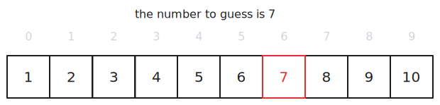
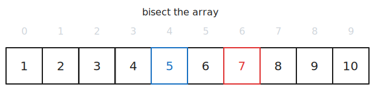
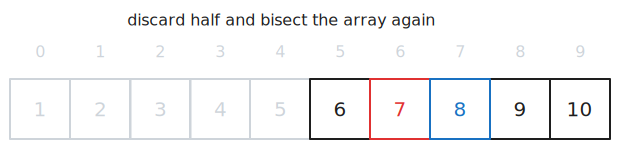
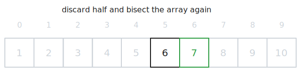

Binary Search is a search algorithm that continually bisects a sorted array in order to find a given value. It is also known as "binary chop", "half-interval search" and "logarithmic search".

You intuitively use this algorithm when searching through a dictionary or [phonebook](https://en.wikipedia.org/wiki/Telephone_directory). If the word or person you're looking for starts with "O", you would open the book roughly in the middle instead of paging through it from the beginning.

We could explain this algorithm practically using the "I'm thinking of a number between x and y, what is it" game 😅.

## I'm Thinking of a Number

Player one thinks of a number (7) between two other numbers - say, 1 and 10 - and player two attempts to guess (or, in our case compute with an algorithm) the answer.

### Step 1

We suggest the number at the *midpoint* of the number range - that is, 5. By doing this we are *bisecting* the group/set of potential numbers.

Player one informs us that our guess is *too low* - we continue.

### Step 2

Because our guess is too low, we *discard* the lower half of the set of numbers - that is, 1 through 5 - as we can be sure that the number we're looking for isn't present in this group. We suggest the number at the midpoint of the new group - 8.

Player one informs us that our guess is *too high* - we continue.

### Step 3

Because our guess is too high, we *discard* the upper half of the remaining group of numbers - that is, 8 through 10 - and, using bisection method, suggest 7.

Player one cowers at our algorithmic powers and admits defeat!

Had we used [linear search](/programming/general/linear-search), that is, starting from 1 and guessing each subsequent number in the set until we hit the correct one, it would have taken us 7 guesses. Using binary search, it took us 3 guesses.

## Complexity

Binary Search chops the set of numbers in half with every step which enables it to execute in [logarithmic time](/category/programming/general/understanding-big-o#logarithmic-time-or-ologn) - $O(log\cdot n)$ where $n$ is the number of elements in the set/array.

In our example, we had 10 items in the set and $O(log\cdot n) = O(log\cdot 10) = 3.32$ confirms that it took us 3 guesses. If we had a set of 1000 values it would take us a maximum of 10 guesses.

### Time

- worse-case time complexity - $O(log\cdot n)$ ([logarithmic](/category/programming/general/understanding-big-o#logarithmic-time-or-ologn))
- best-case time complexity - $O(1)$ ([constant time](/category/programming/general/understanding-big-o#constant-time-or-o1))

### Space

- using iteration - $O(1)$ ([constant time](/category/programming/general/understanding-big-o#constant-time-or-o1))
- using recursion - $O(log\cdot n)$ ([logarithmic](/category/programming/general/understanding-big-o#logarithmic-time-or-ologn))

## Advantages

- efficiency because of its logarithmic time complexity
- predictable performance
- space efficient if using an iterative solution
- scales well
- simple implementation

## Disadvantages

- the array of values needs to be sorted
- if values' comparison operations are heavy, overhead can add up
- less effective when the data set is smaller
- increase in memory overhead if using recursion

## Code Examples

[](https://github.com/claudemuller/algorithms/tree/master/search-algorithms/binary-search/go)
[](https://github.com/claudemuller/algorithms/tree/master/search-algorithms/binary-search/c)
[](https://github.com/claudemuller/algorithms/tree/master/search-algorithms/binary-search/rust)
[](https://github.com/claudemuller/algorithms/tree/master/search-algorithms/binary-search/js)
