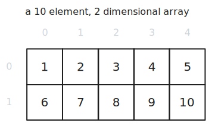

### Table of Contents

- [Arrays](#arrays)

# What is a Data Structure?

A data structure is a method for storing, managing and organising data in a computer according to a set of rules in order to provide certain advantages with regard to space and efficiency of the data and its access and mutation.

# Arrays

Arrays are one of the more basic data structures and very broadly-used. Arrays are stored in contiguous memory chunks which provides some benefits and drawbacks. In some languages like JavaScript however, arrays are objects and thus not of a fixed size or necessarily stored contiguously.

## One Dimensional Arrays

### Advantages

- because the data is stored in contiguous memory, sequential access is fast as we're able to take advantage of cache efficiency
- accessing a known index is done in constant time ($O(1)$)

### Disadvantages

- because the data is stored in contiguous memory, they can not be resized and need to be declared with a size up front
- certain programming languages make it appear that an array is being resized, but usually a larger copy is made elsewhere in memory which comes at a cost

### Code Examples

[](https://github.com/claudemuller/data-structures/tree/master/arrays/go)
[](https://github.com/claudemuller/data-structures/tree/master/arrays/c)
[](https://github.com/claudemuller/data-structures/tree/master/arrays/js)
[](https://github.com/claudemuller/data-structures/tree/master/arrays/ts)

## Two Dimensional Arrays

### Advantages

- because the data is stored in contiguous memory, sequential access is fast as we're able to take advantage of cache efficiency
- accessing a known index is done in constant time ($O(1)$)

### Disadvantages

- because the data is stored in contiguous memory, they can not be resized and need to be declared with a size up front
- certain programming languages make it appear that an array is being resized, but usually a larger copy is made elsewhere in memory which comes at a cost

### Code Examples

[](https://github.com/claudemuller/data-structures/tree/master/arrays/go)
[](https://github.com/claudemuller/data-structures/tree/master/arrays/c)
[](https://github.com/claudemuller/data-structures/tree/master/arrays/js)
[](https://github.com/claudemuller/data-structures/tree/master/arrays/ts)

