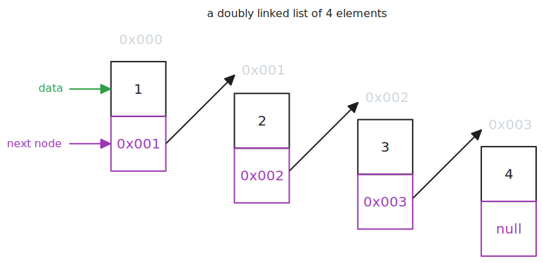

> This article is the second in a [series of articles](/category/programming/general/data-structures/) about data structures.

# Singly Linked Lists

Linked lists are data structures that store data in nodes that are linked together in memory by pointers. The nodes of a linked list are not necessarily stored sequentially. Each node contains the actual data value as well as a pointer to the next node. The pointer to the next node in the last node is set to `null` to indicate the end of the list.

Example of a singly linked list:

## Advantages

- nodes are not constrained to sequential memory, therefore, linked lists can grow and shrink
- can traverse forwards and backwards if using a doubly linked list
- efficient insertions ($O(1)$) and deletions at the beginning or middle of the list as there is no need to shift elements
- linked lists use memory efficiently in the sense that they only allocate space for the number of elements required

## Disadvantages

- can only traverse forwards
- bigger than arrays in memory i.e. increased space complexity, as they need to maintain references to the next node
- accessing nodes is slower than arrays because of the nodes are not sequentially stored i.e. lack of memory locality
- retrieval always $O(n)$, there is no $O(1)$ as there is no direct/random access ability as with arrays

## Usage Examples

- traversing and filtering a collection 

# Doubly Linked Lists

Doubly linked lists are the same as singly linked lists except that nodes contain a pointer to the previous node as well which allow for forward and backward traversal. The pointer to the previous node in the first node is set to `null` to indicate the beginning of the list.

Example of a doubly linked list:

## Advantages

- nodes are not constrained to sequential memory, therefore, linked lists can grow and shrink
- can traverse forwards and backwards
- efficient insertions and deletions at the beginning or middle of the list as there is no need to shift elements
- linked lists use memory efficiently in the sense that they only allocate space for the number of elements required

## Disadvantages

- bigger than arrays in memory i.e. increased space complexity, as they need to maintain references to the next and previous nodes
- accessing nodes is slower than arrays because of the nodes are not sequentially stored i.e. lack of memory locality
- retrieval always $O(n)$ there is no $O(1)$ as there is no direct/random access ability as with arrays

## Usage Examples

- browser history functionality

# Circular Linked Lists

Circular linked lists are the same as doubly linked lists except that they pointer to the previous node in the first nodes points to last node and the pointer in the last node points to the first node creating a list with no end.

Example of a circular linked list:

## Advantages

- nodes are not constrained to sequential memory, therefore, linked lists can grow and shrink
- efficient insertions and deletions at the beginning or middle of the list as there is no need to shift elements
- linked lists use memory efficiently in the sense that they only allocate space for the number of elements required

## Disadvantages

- can traverse forwards only
- bigger than arrays in memory i.e. increased space complexity, as they need to maintain references to the next and previous nodes
- accessing nodes is slower than arrays because of the nodes are not sequentially stored i.e. lack of memory locality
- retrieval always $O(n)$ there is no $O(1)$ as there is no direct/random access ability as with arrays

## Usage Examples

- could be used in [Round-robin scheduling](https://en.wikipedia.org/wiki/Round-robin_scheduling)

# Code Examples

[](https://github.com/claudemuller/data-structures/tree/master/linked-lists/go)
[](https://github.com/claudemuller/data-structures/tree/master/linked-lists/c)
[](https://github.com/claudemuller/data-structures/tree/master/linked-lists/js)
[](https://github.com/claudemuller/data-structures/tree/master/linked-lists/ts)
