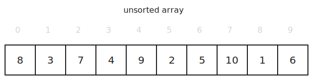
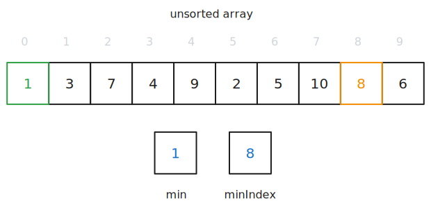
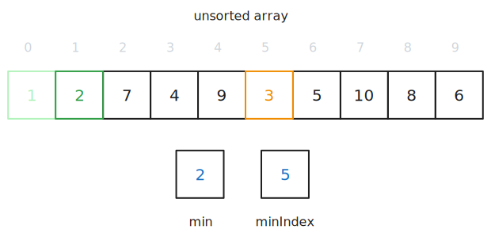

> This article is the third in a [series of articles](/category/programming/general/algorithms/) about algorithms.

Selection sort involves sorting a collection of values by iterating through the collection, picking out the highest value at each iteration and swapping it with item at the start of the current iteration.

## How Does It Work?

Here we have a collection of 10 items, and we would like to sort them from smallest to largest.

### Step 1

We run through the entire array, keeping track of the smallest element and its location. When we reach the end of the array, we swap the smallest value with the value that we started the iteration with. In this case, we started at index 0 with 8 and will swap it with 1 at index 8.

### Step 2

We repeat the same steps, iterating from index 1 as we know that index 0 is already sorted. Thus, this iteration we started at index 1 with 3 and will swap it with 2 at index 5.

### Step 3

We repeat the same steps, swapping 7 at index 2 with 3 at index 5.

### Step 4

We repeat the same steps but find that 4 and our start index of 3 is already the smallest integer, so we do nothing.

### Step 5, 6, 7, 8, 9, 10

We repeat the previous steps until we have sorted all the items.

## Complexity

This algorithm runs in [quadratic-time](quadratic-time.md) because you have to check every element in the collection, sans the elements found on the previous iterations, with every iteration.

Technically, would be $O(n\cdot \frac{1}{2}\cdot n)$, where $n$ represents the number of elements in the collection, but because constant values are dropped in Big O notation, it is simply $O(n^2)$.

### Time

- worse-case time complexity - $O(n^2)$ ([quadratic-time](quadratic-time.md))

### Space

Space complexity refers to amount of memory needed for the algorithm in addition to the input data and because the array is sorted in-place, no additional space is needed.

- $O(1)$ ([constant time](/category/programming/general/understanding-big-o#constant-time-or-o1))

## Advantages

- simple implementation
- good enough on small datasets
- if writing memory is costly, selection sort is advantageous as it performs fewer swaps than other simple sorting algorithms
- sorting in-place means that it doesn't require more space beyond its input

## Disadvantages

- inefficiency grows quadratically as the input data grows
- not stable i.e. does not preserve the relative order of equal elements
- not adaptive i.e. the number of comparisons doesn't decrease if parts of the collection are already sorted
- not the most optimal solution for data structures with special properties such as trees or hash tables

## Code Examples

[](https://github.com/claudemuller/algorithms/tree/master/sorting-algorithms/selection-sort/go)
[](https://github.com/claudemuller/algorithms/tree/master/sorting-algorithms/selection-sort/c)
[](https://github.com/claudemuller/algorithms/tree/master/sorting-algorithms/selection-sort/rust)
[](https://github.com/claudemuller/algorithms/tree/master/sorting-algorithms/selection-sort/js)
