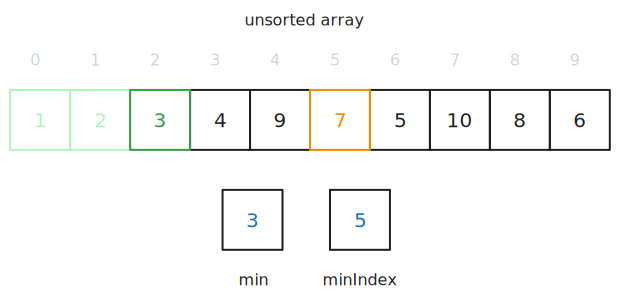
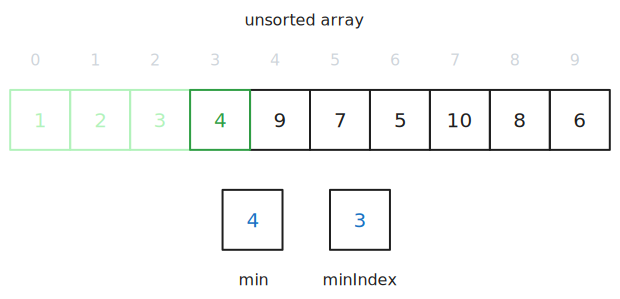
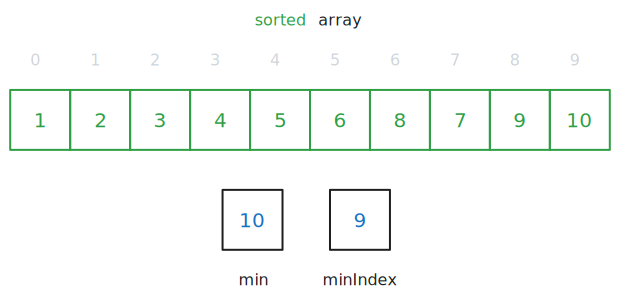

> This article is the third in a [series of articles](/category/programming/general/algorithms/) about algorithms.

Selection sort involves sorting a collection of values by iterating through the collection, picking out the highest value at each iteration and appending that to a new collection.

## How Does It Work?

Here we have a collection of 10 items, and we would like to sort them from smallest to largest.

### Step 1

We create an empty array of the same size as the original array.

### Step 2

Then we run through the entire array, keeping track of the smallest element and its location. When we reach the end of the array, we delete the smallest value from the original array and append it to the new one. In this case it is 1 at index 8.

### Step 3

We repeat the previous step and move 2 from index 5.

### Step 4

We repeat the previous step and move 3 from index 1.

### Step 5, 6, 7, 8, 9, 10

We repeat the previous steps until we have all but the last item moved.

### Step 11

The final value of 10, located at position 0, is moved and we have a sorted array!

## Complexity

This algorithm runs in [quadratic-time](articles/programming/general/understanding-big-o/_resources/quadratic-time.md) because you have to check every element in the collection, sans the element found on the previous iteration, with every iteration.

Technically, would be $O(n\cdot \frac{1}{2}\cdot n)$, where $n$ represents the number of elements in the collection, but because constant values are dropped in Big O notation, it is simply $O(n^2)$.

### Time

- worse-case time complexity - $O(n^2)$ ([quadratic-time](articles/programming/general/understanding-big-o/_resources/quadratic-time.md))

### Space

Space complexity refers to amount of memory needed for the algorithm in addition to the input data.

- $O(1)$ ([constant time](/category/programming/general/understanding-big-o#constant-time-or-o1))

## Advantages

- simple implementation
- good enough on small datasets
- data doesn't need to be sorted
- doesn't require more space beyond its input

## Disadvantages

- inefficiency grows as the input data grows
- not the most optimal solution for sorted data
- not the most optimal solution for repeated searches
- not the most optimal solution for data structures with special properties such as trees or hash tables

## Code Examples

[](https://github.com/claudemuller/algorithms/tree/master/search-algorithms/linear-search/go)
[](https://github.com/claudemuller/algorithms/tree/master/search-algorithms/linear-search/c)
[](https://github.com/claudemuller/algorithms/tree/master/search-algorithms/linear-search/rust)
[](https://github.com/claudemuller/algorithms/tree/master/search-algorithms/linear-search/js)
