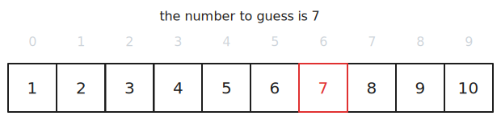

Simple search, also referred to as "linear search", is the most basic search algorithm that can be used to locate an item within a collection.

The algorithm involves visiting each location of a collection sequentially, one at a time until you find what you're looking for.

## How Does It Work?

Here we have a collection of 10 items and are looking for the item with the value of 7.

### Step 1

We visit the first location and check for the value.

This is not the value we are looking for - we continue.

### Step 2

We visit the second location and check for the value.

This is not the value we are looking for - we continue.

### Steps 3, 4, 5, 6

We visit the third, fourth, fifth and sixth locations and check for the value.

These are not the values we are looking for - we continue.

### Step 7

Success! We have located 7.

## Complexity

In our example, we had 10 items in the set, and it took us 7 steps to locate the value we were looking for. If the value was in the last location it would have taken us 10 steps. If we had a set of 1000 values it would take us a maximum of 1000 guesses.

So we can say that in the worst-case, it would take us as many steps as the there are items in the collection, or that the time complexity of this algorithm grows linearly as the input grows.

We can express this with Big O of $O(n)$ where $n$ is the number of elements in the collection.

### Time

- worse-case time complexity - $O(n)$ ([linear](/category/programming/general/understanding-big-o#linear-time-or-on))
- best-case time complexity - $O(1)$ ([constant time](/category/programming/general/understanding-big-o#constant-time-or-o1))

### Space

Space complexity refers to amount of memory needed for the algorithm in addition to the input data.

- $O(1)$ ([constant time](/category/programming/general/understanding-big-o#constant-time-or-o1))

## Advantages

- simple implementation
- good enough on small datasets
- data doesn't need to be sorted
- doesn't require more space beyond its input

## Disadvantages

- inefficiency grows as the input data grows
- not the most optimal solution for sorted data
- not the most optimal solution for repeated searches
- not the most optimal solution for data structures with special properties such as trees or hash tables

## Code Examples

[](https://github.com/claudemuller/algorithms/tree/master/search-algorithms/linear-search/go)
[](https://github.com/claudemuller/algorithms/tree/master/search-algorithms/linear-search/c)
[](https://github.com/claudemuller/algorithms/tree/master/search-algorithms/linear-search/rust)
[](https://github.com/claudemuller/algorithms/tree/master/search-algorithms/linear-search/js)
