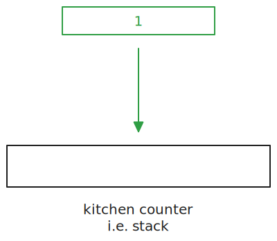
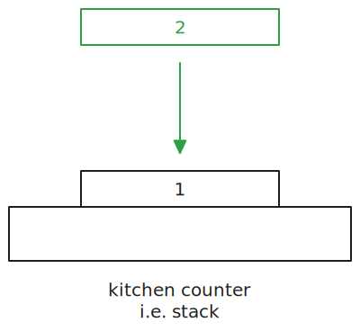
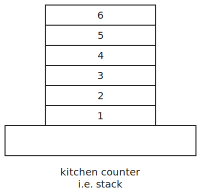
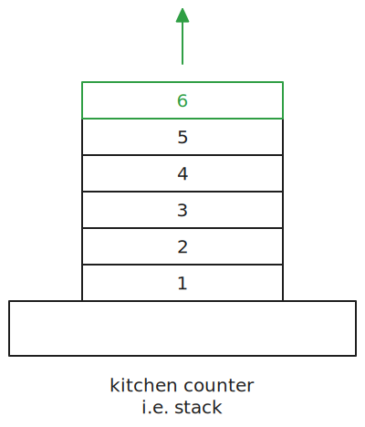

> This article is the third in a [series of articles](/category/programming/general/data-structures/) about data structures.

A stack is a data collection that stores items inserted and removed following the *Last In, First Out* (LIFO) principle. 

## How Does It Work?

We can use the analogy of washing dishes.

### Adding to the Stack

The first dish comes into the kitchen and is placed on the counter. This is referred to *pushing* an item onto the stack and is executed when the `push()` function is called.

The second dish comes in and is placed onto the first dish:

And so on, and so on, and so on...

### Removing From the Stack

Because the dishes are piled onto one another, you can't access any of the dishes except for the one at the top. This is the item that is removed from the stack and returned when the `pop()` function is called.

Stated differently, the *last* item to be added to the stack, here, the number 6, is the *first* to leave.

### Peek-a-Boo

There is usually also a `peek()` function that allows you to see what is at the *top* of the stack without removing it.

## Complexity

- pushes are done in $O(1)$ ([constant time](/category/programming/general/understanding-big-o#constant-time-or-o1)) 
- pops are done in $O(1)$ ([constant time](/category/programming/general/understanding-big-o#constant-time-or-o1))

## Advantages

- simple implementation as you can use most languages' array/list data structures
- efficient data access with $O(1)$
- useful for certain algorithms that required [backtracking](https://en.wikipedia.org/wiki/Backtracking)

## Disadvantages

- inflexible data access as you can only access the element at the top of the stack
- limited capacity if implemented with a fixed size

## Usage Examples

- undo queue
- a [call stack](https://en.wikipedia.org/wiki/Call_stack)

## Code Examples

[](https://github.com/claudemuller/data-structures/tree/master/stacks/go)
[](https://github.com/claudemuller/data-structures/tree/master/stacks/js)
