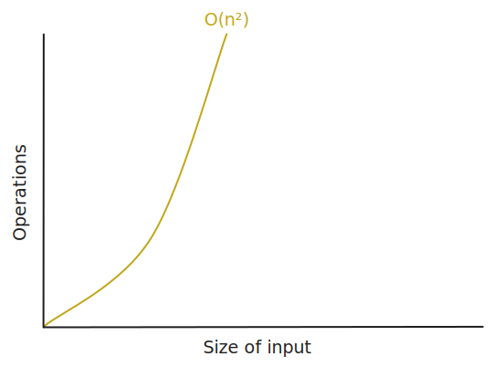
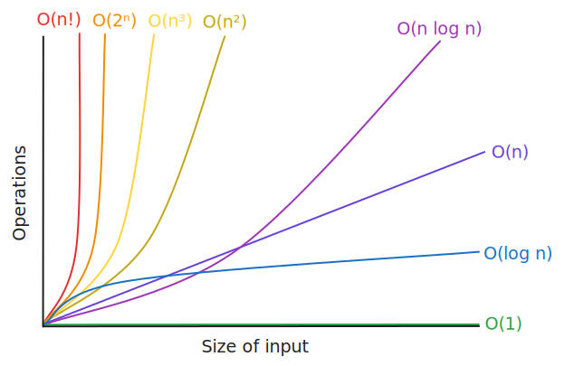

### Table of Contents

- [Constant Time or `O(1)`](#constant-time-or-o1)
- [Polynomial Time](#polynomial-time)
	- [Linear Time or `O(n)`](#linear-time-or-on)
	- [Quadratic Time or `O(n²)`](#quadratic-time-or-on2)
	- [Cubic Time or `O(n³)`](#cubic-time-or-on3)
- [Logarithmic Time or `O(log n)`](#logarithmic-time-or-ologn)
- [Linearithmic Time or `O(n log n)`](#linearithmic-time-or-onlogn)
- [Exponential Time or `O(2ⁿ)`](#exponential-time-or-o2n)
- [Factorial Time or `O(n!)`](#factorial-time-or-on)

With a bit of programming knowledge and experience, anyone could solve any problem. Solving it in the most optimal way however, is a different story altogether. Here, "most optimal" includes the how well your solution scales. Luckily there is a branch of computer science, called [asymptotic analysis](https://en.wikipedia.org/wiki/Asymptotic_analysis), that provides us with a framework we can use to measure the efficiency of our solutions i.e. our [algorithms](/category/programming/general/algorithms). Big-O is the mathematical notation we use to describe an algorithm's complexity in both time and space.

"In both time and space" makes it sound like I'm writing a religious text or a comic book, but what this refers to, given a set of inputs, is how the algorithm under observation performs and scales with regard to:
- its running time i.e. how many operations will it need to complete; and
- how much RAM/memory the solution consumes during its lifetime with different inputs.

Big-O is always in terms of the worst-case scenario. So even if we have a list and need to iterate through it to find an item and the item we're looking for is the first one, we would still think of its complexity in terms of the worst possible outcome.

You may have come across a term that looks something like: *$O(something)$*. The "O" at the beginning of is where the name of the notation comes from - "Big-O" 😅. The `something` represents the expression that tells you what the complexity cost of the algorithm is. When you communicate or read this notation, you do so as "on the order of *something* operations for all possible inputs", or more simply, "order *something*". So for $O(1)$ you would say "on the order of 1 operation for all possible inputs", or simply, "order 1".

# Constant Time or $O(1)$

An algorithmic complexity of $O(1)$, or *constant time*, is used to describe an algorithm that executes in the same amount of time regardless of the size of its inputs. The best analysis that you could hope for is order 1, or $O(1)$.

## Example

If you have an array and know the position of the element you want to access, say the third element, you would simply access it using array index notation (remembering that arrays in JavaScript start at index **0**). Here, we index into the 3rd position.


### Some JavaScript Code

```js
const array = [1, 2, 3, 4, 5, 6, 7, 8, 9, 10]
// It only ever takes one operation to grab a result - O(1)
const result = array[2]

console.log(result) // 3
```

### Algorithm Analysis

- how many inputs (`n`)?
	- `n = 10`
- how many operations to find element with `n` of 10? 
	- `ops = 1`
- how many operations to find element with `n` of 1,000,000? 
	- `ops = 1`

### The Lingo

We would say that this algorithm:
- is on the order of 1 operation for all possible inputs; or 
- is of order 1; or 
- is $O(1)$; or more informally;
- takes/executes/operates in *constant time*


## Examples of $O(1)$

- direct access by indexing into an array
- accessing a map/associative array by key

# Polynomial Time

An algorithmic complexity executing in *polynomial time* refers to an algorithmic complexity where the time taken to complete the operation in question grows as a polynomial function of its input size. WTF does that mean, you may ask - I know I did. Let's break it down:
- "a function of" - a function is a thing that takes an input and gives an output based on some rules
- "polynomial" - an expression that uses variables, constants and exponents to calculate something

So, when we say, the algorithm's execution time grows as a polynomial function of its input size, we are saying that the time it takes for the algorithm to run depends on a formula containing the input size and some rule describing how aggressively that time grows, based on the input size.

For example, if the time it takes the algorithm to complete doubles when we double the input size, it may be a linear function - $O(n)$; if the execution time takes four times longer when we double the input, it may be a quadratic function - $O(n^2)$.

## Linear Time or $O(n)$

*Linear time* refers to an algorithmic complexity where the time taken to complete the algorithm grows in proportion to the size of its inputs. When you have an array of items but do not know the index of the item you're after, you would have to iterate over the items until you find the one you're looking for. In the worst-case scenario, you would have to iterate over all the items if the item you wanted was the last one.

Traditionally, we would use `n` to represent the size of the input. If we had a collection of 10 elements, we would have a notation of $O(10)$, however, in order to describe an algorithm that potentially has an input of any size, we would replace the number of elements, 10 in this case, with `n`.

### Example

If you have a 10 item array as before, you would have to iterate over 8 items if the result you are after is at the 8th index.


#### Some JavaScript Code

```js
const array = [1, 2, 3, 4, 5, 6, 7, 8, 9, 10]
// The number of iterations increases as the array size increases - O(n)
const result = array.find(n => n === 8)

console.log(result) // 8
```

#### Algorithm Analysis

- how many inputs (`n`)?
	- `n = 10`
- how many operations to find element with `n` of 10? 
	- `ops = 10`
- how many operations to find element with `n` of 1,000,000? 
	- `ops = 1,000,000`

### The Lingo

We would say that this algorithm:
- is on the order of `n` operations for all possible inputs; or
- order `n`; or
- is $O(n)$; or more informally;
- operates in *linear time*


### Examples of $O(n)$

- sequential searching of an array
- summing of one-dimensional array
- if there is a loop in the code you can be confident that it executes in *linear time*

## Quadratic Time or $O(n^2)$

*Quadratic time* refers to when the execution time of an algorithm grows with an exponential factor of 2 as the size of its input increases.

### Example

If we need to do a nested traversal on the same collection, such as when attempting to find duplicates, we would not only need to loop over every element of the array, but also over every element a second time for every element during the first loop. Because we need to loop over the array twice in a nested fashion, we would multiply the size of the array during the first traversal, `n`, by the size of the array during the second traversal to calculate the running time. This will give us $n*n$ or simply $n^2$.


#### Some JavaScript Code

```js
const duplicates = collection => {
    // The first iteration - O(n)
    for (let i = 0; i < collection.length; i++) {
        const a = collection[i]
        // The nested traversal - O(n*n) or O(n^2)
        for (let j = 0; j < collection.length; j++) {
            const b = collection[j]
            if (i !== j && a === b) return true
        }
    }
    return false
}

const array = [1, 2, 7, 4, 5, 6, 7, 5, 9, 10]
const result = duplicates(array)

console.log(result) // true
```

#### Algorithm Analysis

- how many inputs (`n`)?
	- `n = 10`
- how many operations to find element with `n` of 10? 
	- `ops = 10*10 = 100`
- how many operations to find element with `n` of 1,000? 
	- `ops = 1,000*1,000 = 1,000,000`



### The Lingo

We would say that this algorithm:
- being on the order of `n²` operations for all possible inputs; or
- order `n²`; or
- is $O(n^2)$; or more informally;
- operates in *quadratic time*
	
### Examples of $O(n^2)$

- finding duplicates in a collection

## Cubic Time or $O(n^3)$

*Cubic time* refers to when the execution time of an algorithm grows with an exponential factor of 3 as the size of its input increases.

### Example

A somewhat contrived example could be to find all the possible combinations of values across 3 lists of integers that sum to a particular number.


#### Some JavaScript Code

```js
const duplicates = (l1, l2, l3) => {
	const res = []
	// The first iteration - O(n)
	for (const n1 of l1) {
		// The first nested traversal - O(n^2)
		for (const n2 of l2) {
			// The second nested traversal - O(n^3)
			for (const n3 of l3) {
				if (n1+n2+n3 === t) res.push([n1, n2, n3])
			}
		}
	}
	return res
}

const l1 = [1, 2, 3, 4]
const l2 = [5, 6, 7, 8]
const l3 = [3, 4, 5, 6]
const result = duplicates(l1, l2, l3)

console.log(result) // [ [ 2, 8, 6 ], [ 3, 7, 6 ], [ 3, 8, 5 ], [ 4, 6, 6 ], [ 4, 7, 5 ], [ 4, 8, 4 ] ]
```

#### Algorithm Analysis

- how many inputs (`n`)?
	- `n = 4`
- how many operations to find element with `n` of 4? 
	- `ops = 4*4*4 = 64`
- how many operations to find element with `n` of 1,000? 
	- `ops = 1,000*1,000*1,000 = 1,000,000,000`


### The Lingo

We would say that this algorithm:
- being on the order of `n³` operations for all possible inputs; or
- order `n³`; or
- is $O(n^3)$; or more informally;
- operates in *cubic time*
	
### Examples of $O(n^3)$

- finding the shortest path in a weighted graph using the [Floyd-Warshall algorithm](https://en.wikipedia.org/wiki/Floyd%E2%80%93Warshall_algorithm)

# Logarithmic Time or $O(log(n))$

An algorithm that executes in *logarithmic time* if the its run time increases slowly as the size of its input grows, as opposed to linearly (as in the case of [linear growth](#linear-time-or-on)) or rapidly (as in the case of [quadratic grow](#quadratic-time-or-on2), [cubic grow](#cubic-time-or-on3) and [exponential growth](#exponential-time-or-o2n)). This is because the growth function ([remember what that is? 😀](#polynomial-time)) is logarithmic.
## Example

A classic example of an algorithm with  *logarithmic time* is binary search. In binary search, the collection is repeatedly divided in half depending on whether the target value is greater than or less than the middle element in the current portion of the collection.

In the following diagram we have an array of 10 elements. On the first iteration we compare the middle value, 5, with the target value, 9. The target is greater than the mid point so we split the array and repeat the compare operation on the upper half. Here, the middle value, 8, is less than the target value so we split the array again. The final sub-array has no mid point, but the algorithm consider this and find the target value of 9.


### Some JavaScript Code

```js
const binarySearch = (haystack, needle) => {
	let low = 0;
	let high = haystack.length - 1;

	// While the range to search hasn't shrunk to zero
	while (low <= high) {
		// The mid-point in our range to search.
		const mid = Math.floor((low + high) / 2);

		// The guess is too low, increase the low index
		if (haystack[mid] < needle) {
			low = mid + 1;
			continue;
		}

		// The guess is too high, reduce the high index
		if (haystack[mid] > needle) {
			high = mid - 1;
			continue;
		}

		// We found it!
		return mid
	}

	return -1
}

const array = [1, 2, 7, 4, 5, 6, 7, 5, 9, 10]
const result = binarySearch(array, 9)

console.log(result) // 8
```

### Algorithm Analysis

- how many inputs (`n`)?
	- `n = 10`
- how many operations to find element with `n` of 10? 
	- `ops = log(10) = 3`
- how many operations to find element with `n` of 1,000,000? 
	- `ops = log(1,000,000) = 6`
	


### The Lingo

We would say that this algorithm:
- being on the order of `log n` operations for all possible inputs; or
- order `log n`; or
- is $O(log(n))$; or more informally;
- operates in *logarithmic time*
	
## Examples of $O(log(n))$

- the binary search algorithm

# Linearithmic Time or $O(n(log(n)))$

> Coming soon to a blog near you 😅

# Exponential Time or $O(2^n)$

> Coming soon to a blog near you 😅

# Factorial Time or $O(n!)$

> Coming soon to a blog near you 😅

# Comparing Complexity

This chart shows the relationship between the number of operations of an algorithm and the size of its inputs. We want to be as close to *constant time* or $O(1)$  as we can get i.e. fewer operations as the size of the input grows.


