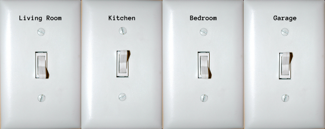

A _bitmask_ is a mask (think of a [multiple choice grading key](https://sockmonkeyscience.com/2019/02/27/grading-multiple-choice-answer-sheets-quickly/)) used to manipulate or reveal values in a _bitmask_. But to understand what a bitmask is we first need to understand what a bitfield is.

## What is a Bitfield

A _bitfield_ is a collection of values that each represent one of two states, or, using a more familiar metaphor -  a row of household switches on a wall, each representing whether the lights are on or off in different rooms or areas around the house. We will use the following image as a tangible example.



### Bits and Bytes

A _bit_ is the smallest piece or data that is used in digital systems such as that in computers. A single bit can either be "on" or "off", or 1 or 0.

A collection of 4 bits is called a _nibble_, 8 bits a _byte_, 16 bits a _halfword_ and 32 bits a _word_.

### Bitfield

Thus, a bitfield is a collection of two or more bits and can be represented by one of the data sizes above but don't have to.

## The Household Example

In the example image we have the lights in the house in the following states:

|Living Room|Kitchen|Bedroom|Garage|
|:---:|:---:|:---:|:---:|
|`off`|`on`|`off`|`on`|

If `off` is the same as `0` and `on` is the same as `1`, then:

|Living Room|Kitchen|Bedroom|Garage|
|:---:|:---:|:---:|:---:|
|`0`|`1`|`0`|`1`|

And that, is a _bitfield_ - `0101` in this case.

## Decimal and Binary

This collection of ones and zeros is what known as the known as [binary numeral system](https://en.wikipedia.org/wiki/Binary_number). The binary numeral system is known as a _base 2_ numeral system. This means that one can only use the two symbols 1 and 0 to express mathematical and computational information.

We humans use the _decimal numeral system_ which is classified as a _base 10_ numeral system and consists of the ten symbols: 0, 1, 2, 3, 4, 5, 6, 7, 8, 9.

We won't go into how to [convert from decimal to binary and back](https://www.rapidtables.com/convert/number/binary-to-decimal.html), but the following table should support the explanation and example.

|Binary|Decimal|
|:---:|:---:|
|0000|0|
|0001|1|
|0010|2|
|0011|3|
|0100|4|
|0101|5|
|0110|6|
|0111|7|
|1000|8|
|1001|9|
|1010|10|
|1011|11|
|1100|12|
|1101|13|
|1110|14|
|1111|15|

Does this look familiar? According to this table, the [current state of the lighting situation](#the-household-example) in the house can be represented as `5` 🤯. So, instead of using _four_ different variables/containers, each with their own size, to store the collective light-switch-state of the house, we can represent the same data with only _one_.

Expressed in JavaScript:

```js
// Instead of...
const houseLights = {
    livingRoom: false, // Boolean with a size of 8 bytes
    kitchen:    true,  // Boolean with a size of 8 bytes
    bedroom:    false, // Boolean with a size of 8 bytes
    garage:     true,  // Boolean with a size of 8 bytes
};

// We can do this...
let houseLights = 5;   // Number with a size of 8 bytes
                       // 5 can be represented as 0b0101
```

## The Benefits of Bitfields

### Space-Saving

And this is where the first benefit of using bitfields comes in - they are a _more compact_ i.e. space-saving, way of storing data. 

In the JavaScript code above, if we assume that an empty object in JavaScript consumes zero bytes in memory (which doesn't of course in reality), then the object of four "light switches", each represented as a boolean (which [take up 8 bytes¹](#footnotes) each), will consume a conservative _32 bytes_ on a 64-bit system.

If we used a _number_ to represent the same data we would only be using _8 bytes_ of memory on the same 64-bit system.

Similarly, these savings appear clearer (as an empty struct consumes zero bytes) in C:

```c
struct {
	bool living_room_light; // int with a size of 8 bytes
	bool kitchen_light;     // int with a size of 8 bytes
	bool bedroom_light;     // int with a size of 8 bytes
	bool garage_light;      // int with a size of 8 bytes
} house_lights = {
	.living_room_light = false,
	.kitchen_light = true,
	.bedroom_light = false,
	.garage_light = true,
};

// Versus...
int house_lights = 5;       // int with a size of 8 bytes
                            // 5 can be represented as 0b0101
```

C does not have a boolean data type. The `bool` syntax above is syntactic sugar for `int` - an integer. Here the struct of `bool` i.e. `int`s, consumes _32 bytes_ in a 64-bit system while the `int` only consumes _8 bytes_ on the same system.

### Easier To Query and Manipulate

And, finally we get to the part about _bitmasks_.

In order to query/read or manipulate values in the bitfield, we use [bitwise operations](https://en.wikipedia.org/wiki/Bitwise_operation). Bitwise operators are operators that operate on single bits. These operators are: AND, OR, NOT, XOR (exclusive-or).

Given that bits are either 1 or 0 we can further explain OR, AND and NOT below.

#### OR

_One_ or _both input_ values should to be `1` for the output to be `1`. The symbol `|` is used in [C-style programming languages](https://en.wikipedia.org/wiki/List_of_C-family_programming_languages) to represent this bitwise operator.

```
1 OR 1 = 1
1 OR 0 = 1
0 OR 1 = 1
0 OR 0 = 0
```

#### AND

_Both input_ values should to be `1` for the output to be `1`. The symbol `&` is used in [C-style programming languages](https://en.wikipedia.org/wiki/List_of_C-family_programming_languages) to represent this bitwise operator.

```
1 AND 1 = 1
1 AND 0 = 0
0 AND 1 = 0
0 AND 0 = 0
```

#### NOT

NOT takes only one input and inverts the output. The symbol `~` is used in [C-style programming languages](https://en.wikipedia.org/wiki/List_of_C-family_programming_languages) to represent this bitwise operator.

Some more benefits of bitfields can be found in the [footnotes²](#footnotes).

*OK, if you're still awake 😅*, let's continue.

## Checking Which Lights Are On

Using our house-hold example, we have a bitfield of:

|Living Room|Kitchen|Bedroom|Garage|
|:---:|:---:|:---:|:---:|
|`0`|`1`|`0`|`1`|

If we have a variable called `house_lights` and want to know whether the _kitchen_ lights are _on_, we would use the _AND_ bitwise operator.

```
                living room   kitchen   bedroom   garage
house_lights =       0           1         0        1
kitchen_light =      0           1         0        0

// ANDing these two bitfields together we get:
    0101     // 5
AND 0100     // 4
    ----
    0100     // 4
```

So we can say: if we _AND_ the `house_lights` and the `kitchen_light` together and the result is equal to `kitchen_light`, then the _kitchen_ light is _on_.

We can use the [binary to decimal table from before](#decimal-and-binary) to get the decimal values we need or use the prefix `0b` (in most C-style languages) to display the binary directly. We can then write the above pseudocode in C as:

```c
int house_lights =  0b0101;  // 5
int kitchen_light = 0b0100;  // 4

bool is_kitchen_light_on = house_lights & kitchen_light;
// is_kitchen_light_on = true
```

## Switching Lights On

Similarly, if we want to _turn_ a light/bit _on_ we use the _OR_ bitwise operator like so:

```
                living room   kitchen   bedroom   garage
house_lights =       0           1         0        1
bedroom_light =      0           0         1        0

// ORing these two bitfields together we get:
    0101     // 5
OR  0010     // 2
    ----
    0111     // 7
```

So we can say: if we _OR_ the `house_lights` and the `bedroom_light` together, the result is the new value/state for `house_lights`, with the _kitchen, bedroom_ and _garage_ lights _on_.

Representing the above pseudocode in C:

```c
int house_lights =  0b0101;  // 5
int bedroom_light = 0b0010;  // 2

int new_house_lights = house_lights | bedroom_light;
// new_house_lights = 0b0111 or 7
```

The state of the house lights are now:

|Living Room|Kitchen|Bedroom|Garage|
|:---:|:---:|:---:|:---:|
|`0`|`1`|`1`|`1`|
|`off`|`on`|`on`|`on`|

## Switching Lights Off

Using a combination of bitwise _AND_ and _NOT_ we can turn turn one of the switches _off_ i.e. flip a bit from 1 to 0.

```c=
int house_lights = 0b0101;  // 5
int garage_light = 0b0001;  // 1

int new_house_lights = house_lights & ~(house_lights & garage_light);
// new_house_lights = 0b0100 or 4
```

Here, on the 4th line, we _AND_ the `house_lights` and the switch we want to turn off, `garage_light` in this case, we _NOT_ that result and, finally, _AND_ that result with the original `house_lights`. Further illustrated:

```

                living room   kitchen   bedroom   garage
house_lights =       0           1         0        1
garage_light =       0           0         0        1

// ANDing these two bitfields together we get:
    0101     // 5
AND 0001     // 1
    ----
    0001     // 1

// NOTing this value we get:
NOT 0001     // 1
    ----
    1110     // 14

// And ANDing this result with the original house_lights we get:
    0101     // 5
AND 1110     // 14
    ----
    0100     // 4
```

And that summarises what _bitmasks_ are and how to use them.

---

### Footnotes<a link="footnotes"></a>

1. A boolean in JavaScript actually has a size of 1 byte, but [byte alignment](https://en.wikipedia.org/wiki/Data_structure_alignment) on 32-bit systems will cause 4 bytes to be used and 8 bytes on 64-bit systems.
2. Other Benefits of Bitfields
    - **Performance** - reading or manipulating a single string of bits at a time is faster than doing so on separate variables
    - **Cache Efficiency** - one can improve cache efficiency when using bitfields as usually one or more can fit in a cache line
    - **Readability and Maintainability** - while bitfields seem hard to read and understand at first they allow one to organise a complex combination of flags into a single variable (name)
    - **Reduced Code Size** - using bitfields can greatly reduce code as a single operation can be done on one line as opposed to setting multiple separate variables
